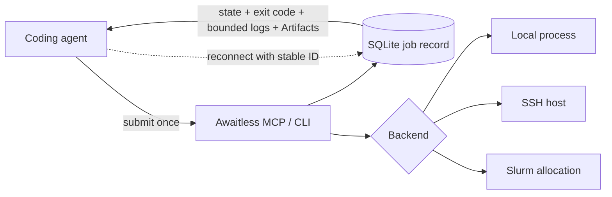

# Awaitless

<!-- mcp-name: io.github.xpluspro/awaitless -->

[](https://github.com/xpluspro/Awaitless/actions/workflows/ci.yml)
[](https://pypi.org/project/awaitless-runner/)
[](https://pypi.org/project/awaitless-runner/)

**Stop polling long-running jobs from your coding agent.**

Awaitless turns local, SSH, and Slurm commands into durable tasks: submit once,
disconnect, and collect the exit code, bounded logs, and JSON results later.
Your workload stays on infrastructure you already own.

[简体中文](README.zh-CN.md) · [Documentation](docs/README.md) ·
[Benchmarks](metric/README.md) · [PyPI](https://pypi.org/project/awaitless-runner/)

## Measured on real agent workloads

| Result | Plain tmux / polling | Awaitless |
|---|---:|---:|
| Median tool calls in 20 paired Agent cases | 7 | **2 (71.4% fewer)** |
| API usage tokens per correct job | 25,974.2 | **3,820.8 (85.3% fewer)** |
| Agent-visible calls in a real SSH polling workload | 13 | **2** |

The Agent results used the same DeepSeek model, prompt, workload, and seed on
2026-08-10. Awaitless returned the correct task state, exit code, Artifact, and
log contract in 20/20 cases; one empty final model response made the strict
end-to-end score 19/20. A strong 319-line tmux wrapper also reached two calls
and used 9.2% fewer tokens than Awaitless—the value there is the built-in,
maintained protocol rather than a universal token advantage.

Read the [full Agent report](metric/results/deepseek-agent-v2-report.md), the
[benchmark methodology](metric/README.md), and the separate
[SSH polling experiment with raw results](benchmarks/README.md).


## The polling loop you can delete

Without Awaitless, an agent starts a job and repeatedly pulls the same growing
log back into its context:

```bash
ssh gpu 'run_benchmark > job.log 2>&1 &'
ssh gpu 'tail -n 200 job.log'  # again...
ssh gpu 'tail -n 200 job.log'  # and again...
```

With Awaitless, it submits once and waits once:

```bash
awaitless submit --json --host gpu --artifact results.json -- ./run_benchmark
# {"job_id":"job_019F...","state":"running","backend":"ssh"}

awaitless wait job_019F... --json
# {"state":"succeeded","exit_code":0,"parsed_results":{...}}
```

Interrupt the waiter, close the MCP client, or start a fresh agent session. The
job keeps running; the stable ID is enough to recover its result.

## Try the recovery story in 30 seconds

Linux, Python 3.10+, and Bash are required. Run the built-in demo without a
persistent install:

```bash
uvx --from awaitless-runner awaitless demo --json
```

The demo submits a local job, terminates its first waiting client, reconnects
from a new client using only the job ID, and verifies a JSON Artifact.

For regular CLI use:

```bash
uv tool install awaitless-runner
awaitless doctor --json
```

`pip install awaitless-runner` works too.

## Give it to your coding agent

Add one stdio MCP server to your client's configuration (adapt the outer key to
your client):

```json
{
  "mcpServers": {
    "awaitless": {
      "command": "uvx",
      "args": ["awaitless-runner"]
    }
  }
}
```

Then ask the agent to run a long command with Awaitless. Tasks-aware clients
receive a durable MCP Task handle immediately; other clients use `submit_job`
followed by `wait_for_job`. Retrying an expensive submission with the same
`client_request_id` cannot launch a duplicate job.

For direct CLI use, the whole loop is:

```bash
awaitless submit --json --name tests -- python -m pytest -q
# Save the returned job_id, then:
awaitless wait <job-id> --json
```

## One interface, three places to run

| Backend | What Awaitless adds |
|---|---|
| **Local** | Durable process-group tracking, cancellation, bounded logs, and recovery after the client exits. |
| **SSH** | The same job contract on an existing host, with heartbeat-based liveness and no remote daemon. |
| **Slurm** | Real `sbatch` scheduling plus durable Slurm IDs, queue/accounting state, exit codes, logs, cancellation, and Artifacts. |

Use `--backend`, `--host`, or configuration defaults to switch targets without
changing how the agent submits and collects work.

## Why not just use a shell or tmux?

| Tool | Best at | What the agent still has to build |
|---|---|---|
| Blocking shell call | Short commands | Nothing—use it when disconnect recovery and a free tool slot do not matter. |
| Shell polling / `nohup` | Keeping a basic command alive | IDs, status, exit-code recovery, bounded logs, cancellation, deduplication, and result parsing. |
| `tmux` | Humans detaching from interactive shells, REPLs, and TUIs | A reliable non-interactive job protocol and wrapper glue. |
| **Awaitless** | Agent-run builds, tests, benchmarks, remote jobs, and cluster work | Only the command and, optionally, the JSON Artifact to return. |

Awaitless does not replace interactive terminals or Slurm. It gives coding
agents a durable task interface and uses Slurm when resources must be scheduled.

## How it works



There is no Awaitless daemon, HTTP service, or hosted sandbox. Each invocation
opens the same SQLite store; submitted runners and scheduler jobs outlive the
stdio server that created them. Full logs remain on disk while only bounded
tails enter the agent context.

## Documentation

- [Documentation index](docs/README.md)
- [CLI, configuration, SSH, Slurm, persistence, Artifacts, and troubleshooting](docs/REFERENCE.md)
- [MCP Tasks protocol and compatibility](docs/MCP_TASKS.md)
- [Benchmark definitions, methodology, and interpretation](metric/README.md)
- [Real MCP → Slurm disconnect evidence](docs/REFERENCE.md#real-mcp--slurm-disconnect-evidence)
- [Architecture and design rationale](docs/REFERENCE.md#architecture-and-runtime-model)

## License

[MIT](LICENSE)
