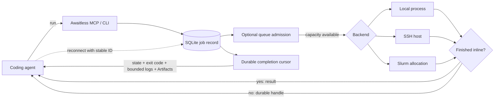

# Awaitless

<!-- mcp-name: io.github.xpluspro/awaitless -->

[](https://github.com/xpluspro/Awaitless/actions/workflows/ci.yml)
[](https://pypi.org/project/awaitless-runner/)
[](https://pypi.org/project/awaitless-runner/)

**Adaptive durable execution for coding agents.**

Run commands through one execution layer. Quick work returns inline; longer or
queued work becomes durable across local, SSH, and Slurm. Your workload stays
on infrastructure you already own.

> **Agents submit work. Awaitless owns execution.**

Awaitless is the adaptive durable execution layer between coding agents and the
compute they use. It gives agents one stable job contract while reusing your local
machine, SSH hosts, and Slurm clusters underneath.

[简体中文](README.zh-CN.md) · [Documentation](docs/README.md) ·
[Benchmarks](metric/README.md) · [PyPI](https://pypi.org/project/awaitless-runner/)

## One job lifecycle across your existing compute

```text
Coding agent → submit work → Awaitless owns the job lifecycle → Local / SSH / Slurm
```

| Durable jobs | Named scarce-resource queues | Completion and recovery |
|---|---|---|
| Stable IDs, state, cancellation, bounded logs, and Artifacts survive client disconnects. | Durable FIFO admission prevents too many jobs from entering a named resource at once. | Exit codes and results remain available by Job ID or replayable completion cursor. |

Awaitless owns the **job lifecycle**, not the hardware. It does not discover
resources, understand GPU topology, allocate multiple resources, or replace a
cluster scheduler. Operators name queues and set fixed concurrency; Slurm
continues to handle requests such as `--gpus 2 --mem 64G` and all physical
cluster scheduling.


## Your coding agent should write code, not babysit jobs

An agent can write its own `run → sleep → check` loop. The harder problem is
making job identity, disconnect recovery, queue admission, cancellation, and
result delivery reliable across long workloads and changing sessions. Without
that execution layer, the agent repeatedly pulls the same growing log back into
its context:

```bash
ssh gpu 'run_benchmark > job.log 2>&1 &'
ssh gpu 'tail -n 200 job.log'  # again...
ssh gpu 'tail -n 200 job.log'  # and again...
```

Awaitless turns that lifecycle into one adaptive execution call and one result
boundary:

```bash
awaitless run --json --host gpu --artifact results.json -- ./run_benchmark
# quick: {"state":"succeeded","delivery":"inline","exit_code":0,...}
# longer: {"job_id":"job_019F...","state":"running","delivery":"detached",...}

awaitless wait job_019F... --json
# {"state":"succeeded","exit_code":0,"parsed_results":{...}}
```

Every `run` is durable before launch. Finishing within the inline window looks
like an ordinary command result; crossing it only detaches the waiter. Interrupt
the waiter, close the MCP client, or start a fresh agent session: the Job keeps
running and its stable ID recovers the result.

## Queue work before a named resource is free

Create a durable FIFO queue once, then submit every command immediately:

```bash
awaitless queue create gpu0 --concurrency 1

awaitless submit --queue gpu0 -- python train_a.py
awaitless submit --queue gpu0 -- python train_b.py
awaitless submit --queue gpu0 -- python train_c.py
```

The first command runs and the others report `queued`. Each starts automatically
when capacity becomes available. This is durable admission control for a named
scarce resource: fixed concurrency and FIFO ordering, with no priority or
preemption. Awaitless never kills running work to make room for a later job.

Operators can also bind adaptive runs to a queue globally or per host:

```toml
[hosts.gpu]
hostname = "gpu.example.com"
queue = "gpu0"
```

The Agent can then call `run` without choosing a queue or probing the GPU first.

This queue does not discover resources, understand GPU topology, dynamically
allocate devices, issue leases, or combine requests such as two GPUs plus 64 GB
of memory. Use Slurm or another scheduler for those responsibilities; Awaitless
provides the Agent-facing job lifecycle around that scheduler.

## Consume whichever job finishes next

v0.7 adds `completions ... --drain --json` for consuming a small parallel set
in one call without client-side cursor bookkeeping. Long jobs can emit
structured heartbeat updates with `wait --progress-interval 30s`. Use
`--capture-log PATH` for command-owned logs and `--resource gpu=0` or
`--device 0` for explicit exclusive admission; terminal results freeze bounded
logs, diagnostics, timing, environment, and a SHA-256 identified snapshot.

Submit independent work up front, keep every Job ID, then wait at one durable
completion boundary:

```bash
awaitless completions job_A job_B job_C --json
# {"completions":[...],"next_cursor":"cmp_...","active_job_ids":[...]}

awaitless completions job_A job_B job_C --after cmp_... --json
```

The first call returns already-finished work immediately or blocks until at
least one selected Job completes. Process the batch before advancing to
`next_cursor`; reusing an older cursor safely replays the same completion IDs.
If the client disappears, a new session can continue from the saved cursor.
Awaitless makes continuation results durably available—it does not run the
agent's next reasoning step or require a resident notification service.

In the checked-in deterministic three-Job protocol case, per-Job polling and
retrieval used 13 Agent-visible CLI calls while the completion feed used 6. It
is a protocol benchmark, not a model or token claim. See the
[method and raw result](benchmarks/README.md#multi-job-completion-benchmark).

## Measured on real agent workloads

These results show why a maintained execution protocol is useful; reduced tool
calls and tokens are evidence, not the product category.

| Result | Plain tmux / polling | Awaitless |
|---|---:|---:|
| Median tool calls in 20 paired Agent cases | 7 | **2 (71.4% fewer)** |
| API usage tokens per correct job | 25,974.2 | **3,820.8 (85.3% fewer)** |
| Agent-visible calls in a real SSH polling workload | 13 | **2** |

The Agent results used the same DeepSeek model, prompt, workload, and seed on
2026-08-10. Awaitless returned the correct task state, exit code, Artifact, and
log contract in 20/20 cases; one empty final model response made the strict
end-to-end score 19/20. A strong 319-line tmux wrapper also reached two calls
and used 9.2% fewer tokens than Awaitless—the value there is the built-in,
maintained protocol rather than a universal token advantage.

Read the [full Agent report](metric/results/deepseek-agent-v2-report.md), the
[benchmark methodology](metric/README.md), and the separate
[SSH polling experiment with raw results](benchmarks/README.md).

## Try the recovery story in 30 seconds

Linux, Python 3.10+, and Bash are required. Run the built-in demo without a
persistent install:

```bash
uvx --from awaitless-runner awaitless demo --json
```

The demo submits two local jobs, terminates their first completion waiter, then
uses new clients to consume both bounded results and JSON Artifacts by cursor.

For regular CLI use:

```bash
uv tool install awaitless-runner
awaitless doctor --json
```

`pip install awaitless-runner` works too.

## Give it to your coding agent

Add one stdio MCP server to your client's configuration (adapt the outer key to
your client):

```json
{
  "mcpServers": {
    "awaitless": {
      "command": "uvx",
      "args": ["awaitless-runner"]
    }
  }
}
```

The preferred `run` tool returns quick commands inline and automatically gives
longer or queued work a durable handle. Tasks-aware clients can still use
`run_job`, while low-level clients retain `submit_job` and `wait_for_job`.
Retrying an expensive submission with the same
`client_request_id` cannot launch a duplicate job. For parallel work, every
client can use `wait_for_completions` regardless of MCP Tasks support.

### Codex plugin

This repository is also a Codex plugin. Its manifest bundles the Awaitless agent
skill with the stdio MCP server, which Codex launches through `uvx`. Install the
repository from a local Codex marketplace, then start a new Codex task so the
skill and MCP tools are loaded together.

The plugin requires `uvx` on `PATH`; the first MCP launch downloads
`awaitless-runner` from PyPI if it is not already cached.

For direct CLI use, the whole loop is:

```bash
awaitless run --json --name tests -- python -m pytest -q
# If delivery is detached, save the returned job_id, then:
awaitless wait <job-id> --json
```

## One interface, three places to run

| Backend | What Awaitless adds |
|---|---|
| **Local** | Durable process-group tracking, cancellation, bounded logs, and transactional named queues. |
| **SSH** | The same job contract plus queues coordinated on the target host, with no remote daemon. |
| **Slurm** | Real `sbatch` scheduling plus durable Slurm IDs, queue/accounting state, exit codes, logs, cancellation, and Artifacts. |

Use `--backend`, `--host`, or configuration defaults to switch targets without
changing how the agent submits and collects work.

## Why not just use a shell or tmux?

| Tool | Best at | What the agent still has to build |
|---|---|---|
| Blocking shell call | Quick inspection and interactive work | Lifecycle management once an engineering command runs longer than expected. |
| Shell polling / `nohup` | Keeping a basic command alive | IDs, status, exit-code recovery, bounded logs, cancellation, deduplication, and result parsing. |
| `tmux` | Humans detaching from interactive shells, REPLs, and TUIs | A reliable non-interactive job protocol and wrapper glue. |
| **Awaitless** | Agent-run builds, tests, benchmarks, remote jobs, and cluster work | Only the command and, optionally, the JSON Artifact to return. |

Awaitless does not replace interactive terminals or Slurm. It gives coding
agents durable fixed-concurrency queues on local/SSH machines and delegates
cluster resource scheduling to Slurm.

## How it works



There is no Awaitless daemon, HTTP service, or hosted sandbox. Each invocation
opens the same SQLite store; submitted runners and scheduler jobs outlive the
stdio server that created them. Full logs remain on disk while only bounded
tails enter the agent context.

## Documentation

- [Documentation index](docs/README.md)
- [Product positioning and evolution principles](docs/PRD.zh-CN.md)
- [v0.6 adaptive run](docs/v0.6.zh-CN.md)
- [v0.7 immutable completion snapshots](docs/v0.7.zh-CN.md)
- [v0.5 durable completion feed](docs/v0.5.zh-CN.md)
- [CLI, configuration, SSH, Slurm, persistence, Artifacts, and troubleshooting](docs/REFERENCE.md)
- [MCP Tasks protocol and compatibility](docs/MCP_TASKS.md)
- [Benchmark definitions, methodology, and interpretation](metric/README.md)
- [Real MCP → Slurm disconnect evidence](docs/REFERENCE.md#real-mcp--slurm-disconnect-evidence)
- [Architecture and design rationale](docs/REFERENCE.md#architecture-and-runtime-model)

## License

[MIT](LICENSE)
