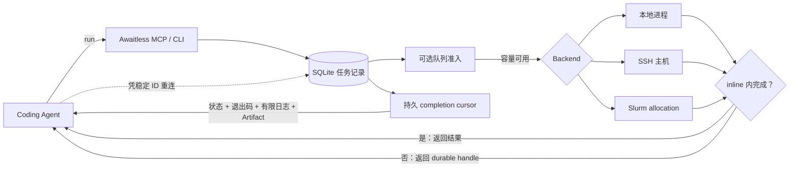

# Awaitless

[](https://github.com/xpluspro/Awaitless/actions/workflows/ci.yml)
[](https://pypi.org/project/awaitless-runner/)
[](https://pypi.org/project/awaitless-runner/)

**面向 Coding Agents 的自适应持久化执行层。**

命令只走一个执行入口：短任务 inline 返回，较长或 queued 的任务自动变成 Local、SSH
和 Slurm 上的持久 Job。工作负载始终运行在你自己的基础设施上。

> **Agents submit work. Awaitless owns execution.**

Awaitless 位于 Coding Agent 与计算资源之间，对上提供一套自适应、稳定的 Job 契约，对下复用你
已有的本地机器、SSH 主机与 Slurm 集群。

[English](README.md) · [完整文档](docs/README.md) ·
[Benchmark](metric/README.md) · [PyPI](https://pypi.org/project/awaitless-runner/)

## 一套任务生命周期，复用已有计算设施

```text
Coding Agent → 提交工作 → Awaitless 管理任务生命周期 → Local / SSH / Slurm
```

| 持久任务 | 命名稀缺资源队列 | 完成与恢复 |
|---|---|---|
| 稳定 ID、状态、取消、有限日志与 Artifact 不因客户端断开而丢失。 | 持久 FIFO 准入控制，避免过多任务同时进入同一个命名资源。 | 退出码与结果可凭 Job ID 或可重放 completion cursor 在新会话取回。 |

Awaitless 管理的是**任务生命周期**，不是硬件资源。它不发现 GPU、不理解设备拓扑，
也不做多资源分配或取代集群调度器。Operator 只需命名队列并设置固定并发；
`--gpus 2 --mem 64G` 这类资源申请与物理集群调度仍由 Slurm 负责。


## Coding Agent 应该写代码，而不是照看任务

Agent 完全可以自己写 `run → sleep → check`。更难的问题是让任务身份、断线恢复、队列
准入、取消和结果交付在长工作负载与不同 session 之间保持可靠。缺少这层执行基础设施时，
Agent 会反复把同一份、越来越长的日志拉回上下文：

```bash
ssh gpu 'run_benchmark > job.log 2>&1 &'
ssh gpu 'tail -n 200 job.log'  # 再查一次……
ssh gpu 'tail -n 200 job.log'  # 再查一次……
```

Awaitless 把这段生命周期收敛为一次自适应执行调用和一个结果边界：

```bash
awaitless run --json --host gpu --artifact results.json -- ./run_benchmark
# 快速完成：{"state":"succeeded","delivery":"inline","exit_code":0,...}
# 继续运行：{"job_id":"job_019F...","state":"running","delivery":"detached",...}

awaitless wait job_019F... --json
# {"state":"succeeded","exit_code":0,"parsed_results":{...}}
```

每次 `run` 都会先创建 durable Job。inline window 内完成时像普通命令一样返回；超过窗口
只会 detach waiter。中断 waiter、关闭 MCP 客户端或换一个全新的 Agent 会话都不会停止
任务，只凭稳定 job ID 就能恢复结果。

## 命名资源还没空闲，也可以现在排队

先创建一个持久 FIFO 队列，之后立即提交所有命令：

```bash
awaitless queue create gpu0 --concurrency 1

awaitless submit --queue gpu0 -- python train_a.py
awaitless submit --queue gpu0 -- python train_b.py
awaitless submit --queue gpu0 -- python train_c.py
```

第一条命令运行，其余任务显示 `queued`；容量释放后，下一个任务会自动启动。这是针对
命名稀缺资源的持久化准入控制：固定并发、FIFO 排序，没有 priority 或抢占，也绝不会
为了后来的任务杀掉正在运行的工作。

Operator 还可以在全局或 host 配置中绑定默认 queue：

```toml
[hosts.gpu]
hostname = "gpu.example.com"
queue = "gpu0"
```

之后 Agent 调用 `run` 时不需要选择 queue，也不需要先探测 GPU 是否空闲。

这个队列不会发现资源、理解 GPU topology、动态分配设备、签发 lease，也不能组合申请
“两张 GPU 加 64 GB 内存”。这些职责继续交给 Slurm 或其他 Scheduler；Awaitless 负责
包裹 Scheduler 外层、面向 Agent 的任务生命周期。

## 哪个任务先完成，就先消费哪个结果

先提交所有相互独立的工作并保存 Job ID，然后在一个持久 completion 边界等待：

```bash
awaitless completions job_A job_B job_C --json
# {"completions":[...],"next_cursor":"cmp_...","active_job_ids":[...]}

awaitless completions job_A job_B job_C --after cmp_... --json
```

第一次调用会立即返回已经完成的工作；没有结果时则阻塞到至少一个所选 Job 完成。处理完
当前批次后再前进到 `next_cursor`；复用旧 cursor 会安全重放相同的 completion ID。客户端
消失后，新 session 可以从保存的 cursor 继续。Awaitless 负责让 continuation result 持久
可用，但不会替 Agent 执行下一步推理，也不要求常驻通知服务。

在仓库内可复现的三 Job 确定性协议案例中，逐 Job polling 与取回结果用了 13 次 Agent 可见
CLI 调用，completion feed 使用 6 次。它是协议 benchmark，不代表模型或 token 结论。参见
[方法和原始结果](benchmarks/README.md#multi-job-completion-benchmark)。

## 真实 Agent 工作负载实测

这些结果说明一套有人维护的执行协议为什么有用；减少工具调用和 token 是证据，不是产品品类。

| 结果 | 普通 tmux / 轮询 | Awaitless |
|---|---:|---:|
| 20 个配对 Agent 案例的中位工具调用 | 7 | **2（减少 71.4%）** |
| 每个正确任务的 API usage token | 25,974.2 | **3,820.8（减少 85.3%）** |
| 一次真实 SSH 轮询任务的 Agent 可见调用 | 13 | **2** |

Agent 实验于 2026-08-10 使用相同的 DeepSeek 模型、提示词、工作负载和随机 seed。
Awaitless 在 20/20 个案例中都正确返回了状态、退出码、Artifact 和日志契约；其中一次
模型最终回复为空，因此严格端到端得分为 19/20。一个 319 行的增强 tmux wrapper
也做到了两次调用，并比 Awaitless 少用 9.2% token——面对这条强基线，Awaitless
的价值是内置且有人维护的统一协议，而不是声称永远更省 token。

查看[完整 Agent 报告](metric/results/deepseek-agent-v2-report.md)、
[benchmark 方法论](metric/README.md)，以及另一项带原始结果的
[SSH 轮询实验](benchmarks/README.md)。

## 30 秒体验断线恢复

Awaitless 需要 Linux、Python 3.10+ 和 Bash。不做持久安装即可运行内置演示：

```bash
uvx --from awaitless-runner awaitless demo --json
```

演示会提交两个本地任务，终止第一个 completion waiter，然后从新客户端按 cursor 消费
两个有限结果并校验 JSON Artifact。

日常 CLI 使用：

```bash
uv tool install awaitless-runner
awaitless doctor --json
```

也可以使用 `pip install awaitless-runner`。

## 交给你的 Coding Agent

在客户端配置中增加一个 stdio MCP server（按客户端格式调整最外层字段）：

```json
{
  "mcpServers": {
    "awaitless": {
      "command": "uvx",
      "args": ["awaitless-runner"]
    }
  }
}
```

首选的 `run` Tool 会 inline 返回快速命令，并自动为较长或 queued 的命令返回 durable
handle。支持 MCP Tasks 的客户端仍可使用 `run_job`，低层客户端继续使用 `submit_job`
和 `wait_for_job`。昂贵任务使用相同
`client_request_id` 重试时不会重复启动。并行任务可以通过 `wait_for_completions` 统一消费，
无论客户端是否支持 MCP Tasks。

直接使用 CLI 的完整流程只有两步：

```bash
awaitless run --json --name tests -- python -m pytest -q
# 如果 delivery 是 detached，保存返回的 job_id，然后：
awaitless wait <job-id> --json
```

## 一套接口，三个运行位置

| Backend | Awaitless 增加的能力 |
|---|---|
| **Local** | 持久进程组跟踪、取消、有限日志和事务化命名队列。 |
| **SSH** | 同一套任务契约，以及在目标主机协调的队列；不需要远端 daemon。 |
| **Slurm** | 真正的 `sbatch` 调度，以及持久 Slurm ID、队列/记账状态、退出码、日志、取消和 Artifact。 |

通过 `--backend`、`--host` 或配置默认值切换目标，不需要改变 Agent 提交与取回任务的方式。

## 为什么不直接用 shell 或 tmux？

| 工具 | 最适合 | Agent 仍需自己补的能力 |
|---|---|---|
| 同步阻塞 shell | 快速观察和交互任务 | 工程命令运行时间超出预期后的生命周期管理。 |
| Shell 轮询 / `nohup` | 让一个简单命令留在后台 | ID、状态、退出码恢复、有限日志、取消、去重与结果解析。 |
| `tmux` | 人类 detach/attach 交互式 shell、REPL 和 TUI | 一套可靠的非交互任务协议与 wrapper glue。 |
| **Awaitless** | Agent 发起的构建、测试、benchmark、远程任务与集群任务 | 只需提供命令，以及可选的 JSON Artifact。 |

Awaitless 不替代交互终端，也不替代 Slurm。它为 Coding Agent 提供持久任务接口，
在本地/SSH 机器上提供固定并发队列，并把集群资源调度交给 Slurm。

## 工作方式



Awaitless 没有 daemon、HTTP 服务或托管 sandbox。每次调用打开同一份 SQLite store；
已提交的 runner 和调度任务独立于创建它的 stdio server。完整日志留在磁盘上，只有受限的
尾部会进入 Agent 上下文。

## 完整文档

- [文档索引](docs/README.md)
- [产品定位与演进原则](docs/PRD.zh-CN.md)
- [v0.6 Adaptive Run 实现说明](docs/v0.6.zh-CN.md)
- [v0.7 Immutable Completion Snapshots 计划](docs/v0.7.zh-CN.md)
- [v0.5 Durable Completion Feed 实现说明](docs/v0.5.zh-CN.md)
- [CLI、配置、SSH、Slurm、持久化、Artifact 与故障排查](docs/REFERENCE.md)
- [MCP Tasks 协议与兼容性](docs/MCP_TASKS.md)
- [Benchmark 定义、方法论与解释边界](metric/README.md)
- [真实 MCP → Slurm 断线证据](docs/REFERENCE.md#real-mcp--slurm-disconnect-evidence)
- [架构与设计取舍](docs/REFERENCE.md#architecture-and-runtime-model)

## License

[MIT](LICENSE)
