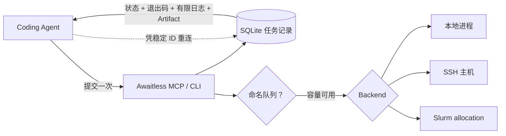

# Awaitless

[](https://github.com/xpluspro/Awaitless/actions/workflows/ci.yml)
[](https://pypi.org/project/awaitless-runner/)
[](https://pypi.org/project/awaitless-runner/)

**别再让 Coding Agent 轮询长任务和稀缺资源。**

Awaitless 把本地、SSH 和 Slurm 命令变成持久任务：提交一次、断开连接，之后再取回
退出码、有限日志和 JSON 结果。命名队列还可以在本地或 SSH 容量可用前替 Agent 等待。
工作负载始终运行在你自己的基础设施上。

[English](README.md) · [完整文档](docs/README.md) ·
[Benchmark](metric/README.md) · [PyPI](https://pypi.org/project/awaitless-runner/)

## 真实 Agent 工作负载实测

| 结果 | 普通 tmux / 轮询 | Awaitless |
|---|---:|---:|
| 20 个配对 Agent 案例的中位工具调用 | 7 | **2（减少 71.4%）** |
| 每个正确任务的 API usage token | 25,974.2 | **3,820.8（减少 85.3%）** |
| 一次真实 SSH 轮询任务的 Agent 可见调用 | 13 | **2** |

Agent 实验于 2026-08-10 使用相同的 DeepSeek 模型、提示词、工作负载和随机 seed。
Awaitless 在 20/20 个案例中都正确返回了状态、退出码、Artifact 和日志契约；其中一次
模型最终回复为空，因此严格端到端得分为 19/20。一个 319 行的增强 tmux wrapper
也做到了两次调用，并比 Awaitless 少用 9.2% token——面对这条强基线，Awaitless
的价值是内置且有人维护的统一协议，而不是声称永远更省 token。

查看[完整 Agent 报告](metric/results/deepseek-agent-v2-report.md)、
[benchmark 方法论](metric/README.md)，以及另一项带原始结果的
[SSH 轮询实验](benchmarks/README.md)。


## 删掉 Agent 的轮询循环

没有 Awaitless 时，Agent 启动任务后会反复把同一份、越来越长的日志拉回上下文：

```bash
ssh gpu 'run_benchmark > job.log 2>&1 &'
ssh gpu 'tail -n 200 job.log'  # 再查一次……
ssh gpu 'tail -n 200 job.log'  # 再查一次……
```

使用 Awaitless，只需提交一次、等待一次：

```bash
awaitless submit --json --host gpu --artifact results.json -- ./run_benchmark
# {"job_id":"job_019F...","state":"running","backend":"ssh"}

awaitless wait job_019F... --json
# {"state":"succeeded","exit_code":0,"parsed_results":{...}}
```

中断 waiter、关闭 MCP 客户端或换一个全新的 Agent 会话都不会停止任务。只凭稳定
job ID 就能恢复结果。

## 资源还没空闲，也可以现在提交

先创建一个持久 FIFO 队列，之后立即提交所有命令：

```bash
awaitless queue create gpu0 --concurrency 1

awaitless submit --queue gpu0 -- python train_a.py
awaitless submit --queue gpu0 -- python train_b.py
awaitless submit --queue gpu0 -- python train_c.py
```

第一条命令运行，其余任务显示 `queued`；容量释放后，下一个任务会自动启动。第一版没有
priority 和抢占，只有固定并发与 FIFO admission，也绝不会为了后来的任务杀掉正在运行的工作。

## 30 秒体验断线恢复

Awaitless 需要 Linux、Python 3.10+ 和 Bash。不做持久安装即可运行内置演示：

```bash
uvx --from awaitless-runner awaitless demo --json
```

演示会提交一个本地任务，终止第一个等待客户端，然后仅凭 job ID 从新客户端恢复，
并校验 JSON Artifact。

日常 CLI 使用：

```bash
uv tool install awaitless-runner
awaitless doctor --json
```

也可以使用 `pip install awaitless-runner`。

## 交给你的 Coding Agent

在客户端配置中增加一个 stdio MCP server（按客户端格式调整最外层字段）：

```json
{
  "mcpServers": {
    "awaitless": {
      "command": "uvx",
      "args": ["awaitless-runner"]
    }
  }
}
```

然后让 Agent 用 Awaitless 执行长命令即可。支持 MCP Tasks 的客户端会立即获得持久
Task handle；其他客户端使用 `submit_job`，之后调用 `wait_for_job`。昂贵任务使用相同
`client_request_id` 重试时不会重复启动。

直接使用 CLI 的完整流程只有两步：

```bash
awaitless submit --json --name tests -- python -m pytest -q
# 保存返回的 job_id，然后：
awaitless wait <job-id> --json
```

## 一套接口，三个运行位置

| Backend | Awaitless 增加的能力 |
|---|---|
| **Local** | 持久进程组跟踪、取消、有限日志和事务化命名队列。 |
| **SSH** | 同一套任务契约，以及在目标主机协调的队列；不需要远端 daemon。 |
| **Slurm** | 真正的 `sbatch` 调度，以及持久 Slurm ID、队列/记账状态、退出码、日志、取消和 Artifact。 |

通过 `--backend`、`--host` 或配置默认值切换目标，不需要改变 Agent 提交与取回任务的方式。

## 为什么不直接用 shell 或 tmux？

| 工具 | 最适合 | Agent 仍需自己补的能力 |
|---|---|---|
| 同步阻塞 shell | 短命令 | 无——不需要断线恢复和释放工具槽时就应该直接用它。 |
| Shell 轮询 / `nohup` | 让一个简单命令留在后台 | ID、状态、退出码恢复、有限日志、取消、去重与结果解析。 |
| `tmux` | 人类 detach/attach 交互式 shell、REPL 和 TUI | 一套可靠的非交互任务协议与 wrapper glue。 |
| **Awaitless** | Agent 发起的构建、测试、benchmark、远程任务与集群任务 | 只需提供命令，以及可选的 JSON Artifact。 |

Awaitless 不替代交互终端，也不替代 Slurm。它为 Coding Agent 提供持久任务接口，
在本地/SSH 机器上提供固定并发队列，并把集群资源调度交给 Slurm。

## 工作方式



Awaitless 没有 daemon、HTTP 服务或托管 sandbox。每次调用打开同一份 SQLite store；
已提交的 runner 和调度任务独立于创建它的 stdio server。完整日志留在磁盘上，只有受限的
尾部会进入 Agent 上下文。

## 完整文档

- [文档索引](docs/README.md)
- [CLI、配置、SSH、Slurm、持久化、Artifact 与故障排查](docs/REFERENCE.md)
- [MCP Tasks 协议与兼容性](docs/MCP_TASKS.md)
- [Benchmark 定义、方法论与解释边界](metric/README.md)
- [真实 MCP → Slurm 断线证据](docs/REFERENCE.md#real-mcp--slurm-disconnect-evidence)
- [架构与设计取舍](docs/REFERENCE.md#architecture-and-runtime-model)

## License

[MIT](LICENSE)
